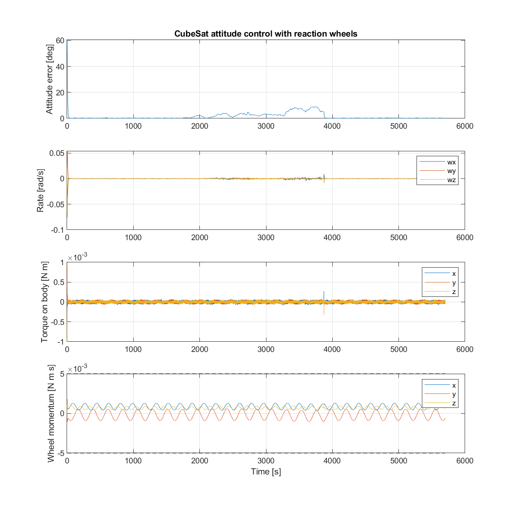
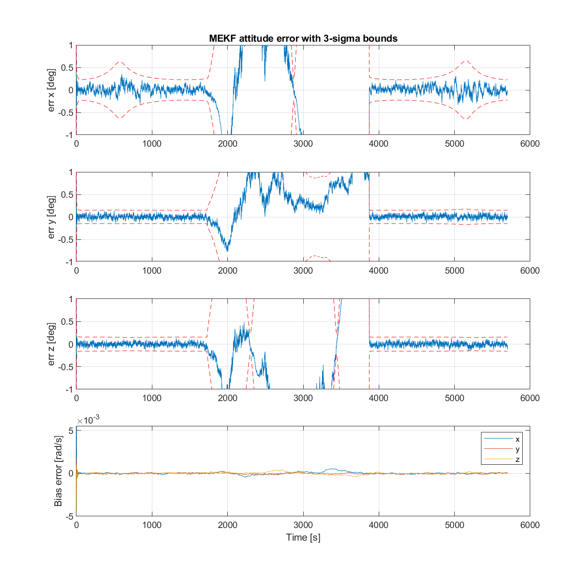

# CubeSat ADCS simulation (side project)

A small attitude determination and control simulation for a CubeSat, in
MATLAB and Simulink. I built it up step by step to learn the basics of ADCS.
It is a personal learning project, not flight software. `NOTES.md` is the
log of what went wrong and what I changed along the way.

## What is ADCS (short version)
A satellite has to point somewhere (a camera at the Earth, an antenna at a
ground station, solar panels at the sun). ADCS is the part that does this:
- **Determination**: work out which way the satellite is pointing, from
  sensors (sun sensor, magnetometer, gyro).
- **Control**: turn it to where it should point, here with reaction wheels
  (spinning one wheel one way turns the satellite the other way).

## What it simulates
- A 3U-size CubeSat in a 500 km circular orbit, going through eclipse
- Three reaction wheels with torque and momentum limits
- Sun sensor, magnetometer and gyro (with noise and a drifting bias)
- TRIAD to get a first attitude, then a MEKF that estimates attitude and gyro bias
- A PD controller that points the satellite using only the estimated attitude
- A requirements check (PASS/FAIL) and a 50-run Monte Carlo
- A Simulink version of the control loop, compared with the MATLAB loop

## Results (one orbit, `run_adcs`, MATLAB R2024b)

| Requirement | Result | Limit | |
|---|---|---|---|
| REQ-01 Pointing error (sunlit) | 0.47 deg | < 2 deg | PASS |
| REQ-02 Body rate (sunlit) | 0.0013 rad/s | < 0.01 rad/s | PASS |
| REQ-03 Peak wheel momentum | 36 % | < 80 % | PASS |
| REQ-04 Sun sensor error (RMS) | 0.41 deg | < 0.5 deg | PASS |
| REQ-05 Magnetometer error (RMS) | 0.81 deg | < 1 deg | PASS |
| REQ-06 Attitude knowledge (sunlit) | 0.35 deg | < 1 deg | PASS |
| REQ-07 Bias estimate error (sunlit) | 2.7e-4 rad/s | < 5e-4 rad/s | PASS |

In eclipse there is no sun sensor and the attitude drifts by several degrees
until the sun comes back. That is why some requirements are only checked in
sunlight (see `docs/requirements.md`).




## Repository
```text
matlab/              the simulation (start from run_adcs.m)
simulink/            Simulink version of the control loop
tests/               quick checks for the quaternion functions and TRIAD
docs/requirements.md what the simulation should achieve
docs/assumptions.md  what is simplified
docs/code_guide.md   how the code works, in which order to read it, glossary
plots/               saved figures
adcs_simulation.py   first Python version (control only)
ekf_estimation.py    first Python version (1-axis EKF)
NOTES.md             bugs, surprises, decisions
```

## How to run
In MATLAB (the scripts use relative paths, so `cd` into the folder first):
```matlab
cd matlab
run_adcs        % one orbit (~95 min simulated, ~40 s to run), prints the requirements check
monte_carlo     % 50 short runs with random start conditions, takes a few minutes
```

Simulink (needs Simulink installed):
```matlab
cd simulink
build_adcs_model   % creates adcs_model.slx (already in the repo, only needed after changes)
run_simulink       % runs 300 s and compares with the MATLAB loop
```

Tests:
```matlab
cd tests
test_quaternions
```

The first Python versions need numpy and matplotlib:
`python adcs_simulation.py` and `python ekf_estimation.py`.

## Status
- [x] Requirements and PASS/FAIL check
- [x] Reaction wheels
- [x] Sensors
- [x] TRIAD + MEKF with gyro bias
- [x] Monte Carlo
- [x] Circular orbit, field direction, eclipse
- [x] Simulink version of the control loop
- [ ] Sensors and MEKF in Simulink
- [ ] Monte Carlo with the orbit (only run before the orbit was added)
